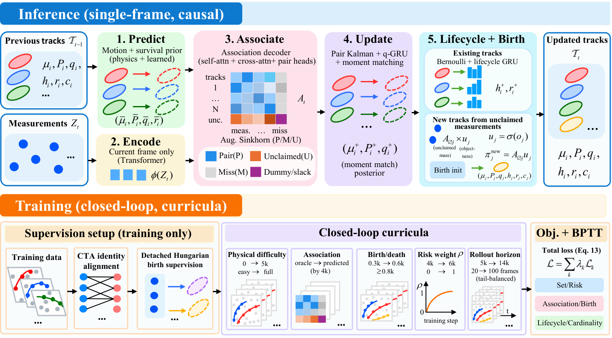

# CNSF Neural Multi-Target Tracking Core

This repository contains the training and evaluation code for three neural
multi-target trackers:

- **Track-MT3**: the full 20-frame sliding-window baseline.
- **Track-MT3-CM**: a capacity-matched Track-MT3 control. `CM` means
  **capacity matched**.
- **CNSF**: the proposed tracker, which encodes the current frame and carries
  information through a recursive track state.

The repository is intentionally limited to the neural methods. Datasets,
checkpoints, generated results, paper sources, and classical baselines are not
included.

## Figures

<p align="center">
  
</p>

<p align="center"><em>CNSF inference architecture and training scheme.</em></p>

Vector version: [CNSF architecture](assets/cnsf_architecture.pdf).

## Model profiles

| Method | Temporal carrier | Encoder / decoder | FFN | Parameters |
|---|---|---:|---:|---:|
| Track-MT3 | 20-frame window | 6 / 6 | 2048 | 19.38M |
| Track-MT3-CM | 20-frame window | 3 / 3 | 1472 | 8.48M |
| CNSF | recursive track state | 3 / 3 | 1024 | 8.54M |

Track-MT3-CM is a parameter/capacity-matched control, not a claim that the two
models have the same backbone. Relative to Track-MT3, it changes only encoder
depth, decoder depth, and feed-forward width:

```text
(6E, 6D, FFN=2048) -> (3E, 3D, FFN=1472)
```

Its parameter count is `8,484,460`, within 0.7% of CNSF's `8,541,221`.
Window size, hidden dimension, query mechanism, positional encodings, losses,
optimizer, learning-rate schedule, and online tracking semantics remain those
of Track-MT3.

## Repository layout

```text
configs/
  paper.yaml                         shared simulation/model configuration
  experiments/scenario{1,2,3}.yaml  evaluation scenarios
  evaluation/operating_points.yaml  frozen global operating points
  training/                          frozen training profiles
scripts/
  train_track_mt3.py                 Track-MT3 training
  train_track_mt3_cm.py              exact-12k Track-MT3-CM training
  train_cnsf.py                      CNSF training
  select_track_mt3_operating_point.py validation-only threshold selection
  evaluate_track_mt3.py              Track-MT3/CM GOSPA, Pro-GOSPA, T-GOSPA
  evaluate_cnsf.py                   CNSF GOSPA and Pro-GOSPA
  evaluate_cnsf_tgospa.py            CNSF native-identity T-GOSPA
  benchmark_neural_inference.py       unified batch-one latency benchmark
track_mt3/
  models/                            Track-MT3 architecture
  models_v17/                        CNSF implementation internals
  training/                          training engines
  tracking/                          online Track-MT3 query propagation
  evaluation/                        trajectory loading and evaluation
  metrics/                           GOSPA, Pro-GOSPA, and T-GOSPA
tests/                               unit and integration tests
```

## Installation

Python 3.9 or newer is recommended. Install a PyTorch build appropriate for the
host CUDA version first, then install this project:

```bash
python3 -m venv .venv
source .venv/bin/activate
python3 -m pip install --upgrade pip
python3 -m pip install -e '.[dev,plots]'
```

Confirm the environment and run the tests:

```bash
python3 -c "import torch; print(torch.__version__, torch.cuda.is_available())"
pytest -q
```

No machine-specific path is required. Run commands from the repository root
with paths relative to that root.

## Evaluation data

Training trajectories are simulated online. The fixed evaluation suite is
generated locally with deterministic seeds:

```bash
python3 scripts/prepare_evaluation_data.py
```

This creates 50 trajectories for each of S1, S2, and S3 under
`datasets/track_mt3_paper/evaluation/`. Each trajectory has frames 0--99;
reported metrics score frames 20--99.

To use a different destination:

```bash
python3 scripts/prepare_evaluation_data.py --output-dir datasets/evaluation
```

## Training

All distributed examples preserve the configured global batch size; the
training code partitions it over the active processes.

### Track-MT3

```bash
PYTHONPATH=. torchrun --standalone --nproc_per_node=4 \
  scripts/train_track_mt3.py \
  --config configs/paper.yaml \
  --overlay configs/training/track_mt3.yaml
```

The paper baseline keeps its original selected 14k checkpoint and is not
replaced by the capacity control.

### Track-MT3-CM

```bash
PYTHONPATH=. torchrun --standalone --nproc_per_node=4 \
  scripts/train_track_mt3_cm.py
```

The launcher enforces fresh initialization, seed 1919, exact 12,000 updates,
disabled early stopping, a 20-frame window, and exactly 8,484,460 parameters.
It refuses to start if the output directory is non-empty. Intermediate
checkpoints are diagnostic only; report `step_012000.pt` without selecting the
best intermediate checkpoint.

### CNSF

```bash
PYTHONPATH=. torchrun --standalone --nproc_per_node=4 \
  scripts/train_cnsf.py \
  --config configs/training/cnsf_exact12k.yaml \
  --output-dir outputs/cnsf_exact12k
```

`scripts/launch_cnsf.sh` is a short launcher for the exact-12k run. Set
`NPROC_PER_NODE` to change the GPU process count.

## Operating-point selection

Select one global Track-MT3-CM operating point on an independent validation
split. Do not tune thresholds separately by scene or on the reported evaluation
suite.

```bash
PYTHONPATH=. python3 scripts/select_track_mt3_operating_point.py \
  --overlay configs/training/track_mt3.yaml \
  --overlay configs/training/track_mt3_cm_exact12k.yaml \
  --checkpoint outputs/track_mt3_cm_exact12k/checkpoints/step_012000.pt \
  --validation-seed 20000 \
  --validation-runs 10 \
  --output outputs/track_mt3_cm_exact12k/operating_point.json
```

The selector minimizes mean GOSPA over S1--S3 using only two Track-MT3 knobs:
the shared existence/QTM detection threshold and the QTM tracking threshold.
Freeze the selected pair before formal evaluation.

All frozen thresholds are kept in
[`configs/evaluation/operating_points.yaml`](configs/evaluation/operating_points.yaml),
separate from this README. The evaluators load that file by default; command-line
threshold options remain available only for controlled sweeps.

## Accuracy evaluation

### Track-MT3

```bash
PYTHONPATH=. python3 scripts/evaluate_track_mt3.py \
  --overlay configs/training/track_mt3.yaml \
  --checkpoint outputs/track_mt3/checkpoints/step_014000.pt \
  --method Track-MT3 \
  --expected-step 14000 \
  --dataset-dir datasets/track_mt3_paper/evaluation \
  --runs 50 \
  --operating-points configs/evaluation/operating_points.yaml \
  --output outputs/track_mt3/evaluation.json
```

### Track-MT3-CM

```bash
PYTHONPATH=. python3 scripts/evaluate_track_mt3.py \
  --overlay configs/training/track_mt3.yaml \
  --overlay configs/training/track_mt3_cm_exact12k.yaml \
  --checkpoint outputs/track_mt3_cm_exact12k/checkpoints/step_012000.pt \
  --method Track-MT3-CM \
  --expected-step 12000 \
  --dataset-dir datasets/track_mt3_paper/evaluation \
  --runs 50 \
  --operating-points configs/evaluation/operating_points.yaml \
  --output outputs/track_mt3_cm_exact12k/evaluation.json
```

This evaluator reports scene-wise GOSPA and the mean GOSPA, Pro-GOSPA, and
T-GOSPA. T-GOSPA uses the model's native cross-frame query identities without
post-hoc relinking.

### CNSF: GOSPA and Pro-GOSPA

```bash
PYTHONPATH=. python3 scripts/evaluate_cnsf.py \
  --config configs/training/cnsf_exact12k.yaml \
  --checkpoint outputs/cnsf_exact12k/checkpoints/step_012000.pt \
  --runs 50 \
  --operating-points configs/evaluation/operating_points.yaml \
  --output outputs/cnsf_exact12k/evaluation.json
```

### CNSF: T-GOSPA

```bash
PYTHONPATH=. python3 scripts/evaluate_cnsf_tgospa.py \
  --config configs/training/cnsf_exact12k.yaml \
  --checkpoint outputs/cnsf_exact12k/checkpoints/step_012000.pt \
  --dataset-dir datasets/track_mt3_paper/evaluation \
  --runs 50 \
  --operating-points configs/evaluation/operating_points.yaml \
  --output outputs/cnsf_exact12k/tgospa.json
```

CNSF T-GOSPA uses runtime track IDs emitted by the recurrent tracker and does
not perform post-hoc trajectory relinking.

## CPU latency

Use batch size 1, one CPU thread, S3 `run_000`, frames 20--99, and five repeats.
Benchmark all methods on the same machine in the same session.

Track-MT3 or Track-MT3-CM:

```bash
OMP_NUM_THREADS=1 MKL_NUM_THREADS=1 OPENBLAS_NUM_THREADS=1 \
NUMEXPR_NUM_THREADS=1 PYTHONPATH=. \
python3 scripts/benchmark_neural_inference.py \
  --device cpu --models track_mt3 --threads 1 --repeats 5 \
  --operating-points configs/evaluation/operating_points.yaml \
  --track-mt3-config configs/training/track_mt3_cm_exact12k.yaml \
  --track-mt3-checkpoint outputs/track_mt3_cm_exact12k/checkpoints/step_012000.pt \
  --trajectory datasets/track_mt3_paper/evaluation/scenario3/run_000.npz \
  --first-scored-frame 20 \
  --output outputs/track_mt3_cm_exact12k/runtime_cpu.json
```

Omit `--track-mt3-config` and point `--track-mt3-checkpoint` at the original checkpoint to
benchmark Track-MT3. For CNSF:

```bash
OMP_NUM_THREADS=1 MKL_NUM_THREADS=1 OPENBLAS_NUM_THREADS=1 \
NUMEXPR_NUM_THREADS=1 PYTHONPATH=. \
python3 scripts/benchmark_neural_inference.py \
  --device cpu --models cnsf --threads 1 --repeats 5 \
  --operating-points configs/evaluation/operating_points.yaml \
  --cnsf-config configs/training/cnsf_exact12k.yaml \
  --cnsf-checkpoint outputs/cnsf_exact12k/checkpoints/step_012000.pt \
  --trajectory datasets/track_mt3_paper/evaluation/scenario3/run_000.npz \
  --first-scored-frame 20 \
  --output outputs/cnsf_exact12k/runtime_cpu.json
```

CPU latency is hardware-specific. Re-measure it when reporting results from a
different machine.

## Metric and checkpoint protocol

- `Pro-GOSPA` means **probabilistic GOSPA**.
- Track-MT3 and Track-MT3-CM use model-native cross-frame query IDs.
- CNSF uses recurrent runtime track IDs.
- No method uses post-hoc identity relinking for T-GOSPA.
- Thresholds are selected once on validation and then frozen globally.
- Track-MT3-CM and CNSF report exact step 12,000; intermediate checkpoints are
  not used for result selection.
- Equal update counts should be described as the same number of optimization
  updates, not the same training compute.

## Artifacts and reproducibility

Checkpoints and generated datasets are deliberately excluded from Git. To
reproduce an experiment, generate the deterministic evaluation set, train the
requested profile, select a validation operating point, and run the evaluation
commands above. Result JSON files record checkpoint paths, operating points,
per-scene metrics, and per-run T-GOSPA values.

## Citation

Citation metadata will be added after the associated arXiv release. Until then,
please cite the repository URL and the commit hash used for the experiment.

```bibtex
@misc{cnsf_neural_tracking,
  title        = {CNSF Neural Multi-Target Tracking Core},
  howpublished = {Software repository},
  note         = {arXiv citation forthcoming}
}
```

## License

See [LICENSE](LICENSE). The T-GOSPA metric implementation is distributed under
its original BSD terms in [THIRD_PARTY_LICENSES/TGOSPA_REFERENCE.txt](THIRD_PARTY_LICENSES/TGOSPA_REFERENCE.txt).
